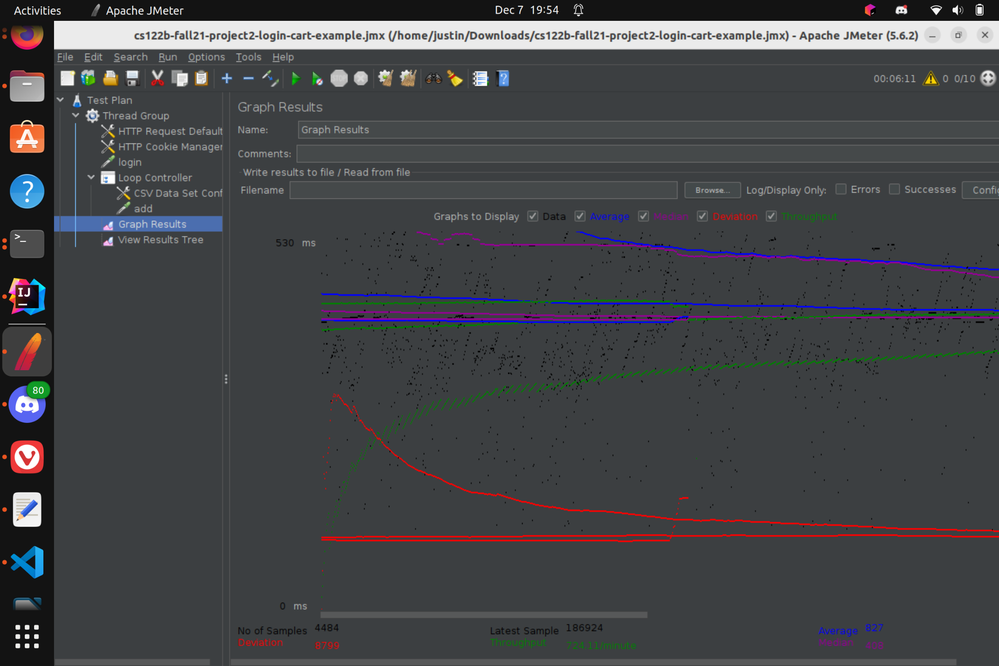

- # General
    - #### Team#:Team-MIPS

    - #### Names:Jose Ruvalcaba, Justin Huang

    - #### Project 5 Video Demo Link:

    - #### Instruction of deployment:

    1. Git clone project
    2. Make sure all dependencies are installed ex tomcat,maven java11 ...
    3. Make sure a mysql user is created with username: mytestuser password: My6$Password
    4. Make sure the database is imported into mysql

    - #### Collaborations and Work Distribution:
  Jose:
    1. Script for taking average time
    2. Added timers for movielist servlet
    3. Ran tests for JMeter for single instance
       Justin:
    1. Tasks 1-3
    2. Ran tests for JMeter for scaled version

- # Connection Pooling
    - #### Include the filename/path of all code/configuration files in GitHub of using JDBC Connection Pooling.
    1. src/_dashboard/LoginEmployeeServlet.java
    2. src/_dashboard/EmployeeDashServlet.java
    3. src/_dashboard/EmployeeDashServlet.java
    4. src/_dashboard/AddStarServlet.java
    5. src/_dashboard/AddMovieServlet.java
    6. src/UpdateSecurePassword.java
    7. src/UpdateSecurePassword.java
    8. src/SingleStarServlet.java
    9. src/SingleMovieServlet.java
    10. src/ShoppingCart.java
    11. src/MovieSuggestion.java
    12. src/MovieListServlet.java
    13. src/MainPageServlet.java
    14. src/LoginServlet.java
    15. src/CheckoutServlet.java
    16. src/AndroidLoginServlet.java
    17. src/InsertMainsAndCasts.java
    18. src/InsertMainsAndCasts.java

    - #### Explain how Connection Pooling is utilized in the Fabflix code.
  Connection pooling is utilized in fablix in that instead of spawning a new connection every time the servlet is ran it utilizes
  the connection pool to get and reuse an existing connection. Currently we have a pool of 30-100 connections that can be utilized
  by the any of the servlets requesting it.

    - #### Explain how Connection Pooling works with two backend SQL.
  Connection pooling works for two backend sql instances in that all reads are sent to the localhost sql instance which is a connection pool. And all writes to mysql are sent to a another connection pool with the target as the master instance, since the
  master instance is the only that can propagate changes to the slave instance. In total we have two connection pool one for write and
  the other for read.

- # Master/Slave
    - #### Include the filename/path of all code/configuration files in GitHub of routing queries to Master/Slave SQL.
  Master/slave (local host):
    1. src/_dashboard/LoginEmployeeServlet.java
    2. src/_dashboard/EmployeeDashServlet.java
    3. src/_dashboard/AddStarServlet.java
    4. src/_dashboard/AddMovieServlet.java
    5. src/UpdateSecurePassword.java
    6. src/SingleStarServlet.java
    7. src/SingleMovieServlet.java
    8. src/ShoppingCart.java
    9. src/MovieSuggestion.java
    10. src/MovieListServlet.java
    11. src/LoginServlet.java
    12. src/InsertMainsAndCasts.java
    13. src/CheckoutServlet.java
    14. src/AndroidLoginServlet.java
    15. src/MainPageServlet.java

  Master Only(writing):
    1. src/_dashboard/AddStarServlet.java
    2. src/_dashboard/AddMovieServlet.java
    3. src/CheckoutServlet.java
    4. src/MovieListServlet.java

    - #### How read/write requests were routed to Master/Slave SQL?
All read request are sent to the local mysql server that could be either the master or slave. And all write requests are sent the
master instance only.

- # JMeter TS/TJ Time Logs
    - #### Instructions of how to use the `log_processing.*` script to process the JMeter logs.
    1. Run script on local machine: python3 log_processing.py
    2. Select whether testing single or scaled version
    3. Input file name for log(default is times.txt)
    4. Values for servlet and JDBC will be printed

- # JMeter TS/TJ Time Measurement Report

| **Single-instance Version Test Plan**          | **Graph Results Screenshot** | **Average Query Time(ms)** | **Average Search Servlet Time(ms)** | **Average JDBC Time(ms)** | **Analysis** |
|------------------------------------------------|-----------------------------|----------------------------|-------------------------------------|---------------------------|--------------|
| Case 1: HTTP/1 thread                          |  | 102                              | 200.93                              | 194.56                         | Connection pooling being enabled saves time from needing to open constantly new connections however only 1 thread being open allows for a fast speeds.           |
| Case 2: HTTP/10 threads                        |   | 245                              | 154.76                              | 154.14                         | Connection pooling is still being used so with 10 threads the performance speed is still pretty good with servlet and jdbc times compared to 1 thread.           |
| Case 3: HTTPS/10 threads                       |  | 286                              | 168.65                              | 166.06                         | Using HTTPS slows down due to the extra security measure which does show in comparison to case 3 but still has good speeds.           |
| Case 4: HTTP/10 threads/No connection pooling  |  | 224                          | 145.27                                  | 132.89                         | In theory this should be the slowest however the performance is on par with cases 2 and 3 with overall query time and somehow better in servlet and jdbc times.           |

| **Scaled Version Test Plan**                   | **Graph Results Screenshot** | **Average Query Time(ms)** | **Average Search Servlet Time(ms)** | **Average JDBC Time(ms)** | **Analysis** |
|------------------------------------------------|------------------------------|----------------------------|-------------------------------------|---------------------------|--------------|
| Case 1: HTTP/1 thread                          |          | 94                      | 21.923                              | 20.274                         | With connection pooling enabled connections are being reused so that saves alot time and there is only one thread so the times are similar to the single instance case 1.           |
| Case 2: HTTP/10 threads                        |             | 261                     | 153.598                             | 152.208                         | Using connection pooling the servlets reuse connections so it is faster and the load balance evenly distributes the load so that each backend instance recieves the same amount of load. So this is faster           |
| Case 3: HTTP/10 threads/No connection pooling  | | 497                     | 157.394                             | 151.127                         | This is the slowest time of them all since there is no connection pooling and the time to spin up a new connection takes up time. Also this is the one with the highest standard deviation for the query time.            |
